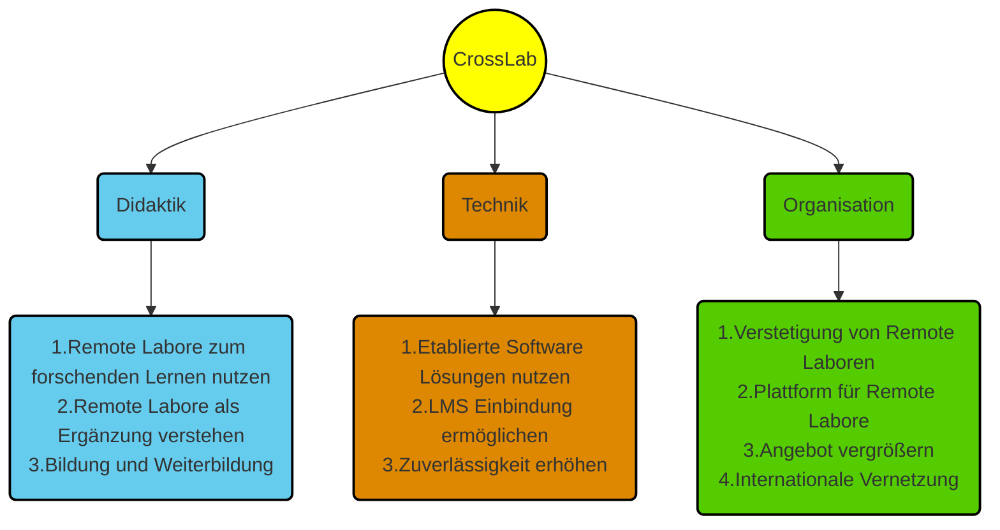

<!--
author:   Mark Jacob
email:    mark.jacob@iuz.tu-freiberg.de
version:  0.1.0
language: en
narrator: US English Female

comment:  This is the first update for colleagues.
          Please let me know if you need more info.

icon: https://upload.wikimedia.org/wikipedia/commons/2/28/Logo_TU_Freiberg.svg

import: https://raw.githubusercontent.com/liaScript/mermaid_template/master/README.md

-->

# Progress Report 1

    {{0}}
> **Author:** Dr. Mark Jacob, IUZ/Languages, TU Bergakademie Freiberg
>
> **Date:** January 19, 2023
>
> **Project:** CrossLab
> This report will provide a brief overview of the **CrossLab consortium project** (hereafter referred to as the **project**).
>
>> **Subproject:** Integration of Remote Labs into English for Specific Purposes Language Courses for students of STEM (science, technology, engineering and mathematics) at institutions of Higher Education (hereafter referred to as the **subproject**). The status of the subproject will be reviewed, covering details on work completed, work in progress and work remaining.

    {{1}}

## **Overview**

    {{0-1}}
> **Project Facts and Figures**
>
> -   start date of project: August 1, 2021
> -   end date of project: July 31, 2024
> -   Universties involved:
>
>  - TU Bergakademie Freiberg (Lead partner)
>  - TU Ilmenau
>  - TU Dortmund
>  - Nordakademie
>
> -   Funded by Stiftung Innovation in der Hochschullehre (ca. €5 million)
>
>> **Subproject Facts and Figures**
>>
>> -   start date of subproject: February 15, 2022
>> -   end date of subproject: July 31, 2024
>> -   Departments involved (TUBAF unless otherwise stated):
>>
>>  - IUZ/ Languages (Lead partner)
>>  - Department of Computer Science
>>  - Department of Chemistry
>>  - Department of Didactics, TU Dortmund
>>
>> -   Funded by Stiftung Innovation in der Hochschullehre (0.5 *Wissenschaftlicher Mitarbeiter* Research Associate)

    {{1-2}}
> **Project Purpose**
>
> CrossLab, funded by the Foundation for Innovation in Teaching in Higher Education,  is a German consortium project that aims to build a network of remote laboratories which are accessible for students from universities in Germany and potentially worldwide. With this, possibilities are opened up for students to experience a wider range of facilities than are available at their own institutions.
>
> The CrossLab project aims to define the **technical**, **didactic** and **organizational** solutions for open digital laboratory objects, which can be combined as required in a learning environment for student-centered teaching and learning.
>
>> **Subproject Purpose**
>>
>> The aim of English language courses at TU Bergakademie Freiberg are to extend the effectiveness of a student's knowledge and use of the English language from general contexts covered during the 8 to 10 years typically spent learning English at school to those specific to academia and to the subject area of the degree course being taken. With this in mind, the approach of the language courses in Freiberg is one of subject-sensitive language teaching.
>>
>> The purpose of the subproject is to maximize the subject-sensitivity of the language teaching by integrating remote labs into the language laboratory, that is, into the English language courses for students of STEM subjects at institutions of Higher Education.

    {{2-3}}
> **Project Scope**
>
> There are four German partner universities involved in the project, each already having developed a number of remote laboratories in the fields such as engineering, chemistry, physics and computer science. The project aims to bring the operation of these remote labs onto a single platform and to develop didactic standards for their use in university courses. New remote laboratory facilities are being developed within the partner universities and eventually these resources will be available to students at other universities in Germany and across the globe.
>
>> **Subproject Scope**
>>
>> The scale of the subproject is rather small in that only one English language instructor is involved and therefore the materials and methods developed will be implemented initially in only three groups of first-year (second semester) students in the course *Introduction to English for Specific Purposes*:
>>
>> - Group 1, Robotics (ROB) and Geoinformatics/Geophysics (BGIP)
>> - Group 2, Mathematics (Mm), Business Mathematics (BWM) and Computer Science (BAI)
>> - Group 3, Chemistry (BCH and Ch)
>>
>> Implementation of the materials and methods will require 3 sessions of the summer semester. In addition to the planned implementations, the subproject will also network with external partners to assist in making the CrossLab infrastructure available to students in other countries, in particular countries in Africa.

    {{3-4}}
> **Project Activities**
>
> Within the project, there are a number of working groups focussing on the technical aspects of building up a platform for the remote laboratories as well as a didactics group, which deals with the integration of the remote laboratories into university teaching. Additionally, competitions have taken place at the four partner universities, in which teaching staff can win funding to develop their own remote laboratories. For more information see the project website https://cross-lab.org/.
>
>> **Subproject Activities**
>>
>> Within the subproject, a student assistant has been hired to develop the software and hardware necessary for creating a remote lab that can be used as a test case for implementing remote labs in English lessons. For more information on this, please refer to the section on work completed.

## **Subproject status**

    {{0-1}}
>> **Work Completed**
>>
>> Thus far the hardware (traffic lights controlled by a microcontroller board) and software necessary to test out the concept of using a remote lab in English lessons have been constructed:

    {{1-2}}
??[Traffic Lights](https://liascript.github.io/course/?https://raw.githubusercontent.com/Mr-Nair/Hiwi-Arduino/main/README.md#8)

    {{2-3}}
>> The hardware to be used in the implementation of the remote lab (LED strip controlled by microcontroller board) has been constructed:

    {{3-4}}
!?[LED Strip](/images/Snapchat-788137995.mp4)

    {{4-5}}
>> **Work in Progress**
>>
>> 1. Lesson plans for the implementations are being prepared.
>> 2. A concept for using images, videos, simulations and remote labs in language courses in general and in particular in English for Specific Purposes courses for students of STEM subjects in the context of Higher Education is being formulated. The advantages and disadvantages of using the above-mentioned media and materials and the benefits of using simulations and remote labs over images and videos can have and at what cost are being considered.
>> 3. The code for the simulation of the LED strip is being written by the student assistant.

    {{5-6}}
>> **Work Remaining**
>>
>> The main task here is the implementation of the remote lab integration in the summer semester of 2023.
>>
>> **Implementation in Groups 1 and 2**
>>
>> Session 1: Preparatory lesson on microcontrollers, how they work, what they consist of and how they can be used in applications. Students have already covered this this topic in lectures and practicals in German. Students will have an opportunity to share experiences they have had working with and writing code for microcontrollers, in particular the Arduino.
>>
>> Session 2: Discussion of possibilities for programming an LED strip, followed by trying out the simulation of the LED strip. Familiarisation with the code for programming the LED strip and then writing a short description of what will be programmed. Homework - to write the code to program the LED strip.
>>
>> Session 3: in groups, show each other the simulations and describe what was done, including any difficulties that may have been overcome or changes of plan due to not managing to convert the plans into code. By the end of the session, students should have written a commentary that lasts about the length of the simulation (3 minutes). Homework - to run the code on the hardware (remote laboratory) and record audio commentary to go with the video.
>>
>> Students submit their videos as coursework (uploaded to OPAL). Deadline for this is 2 weeks.
>>
>> Possible Session 4: Clear up any technical or other issues students may have had recrding video or audio or editing and submitting the final product.
>>
>> **Implementation in Group 3**
>>
>> To be planned in February/March 2023

