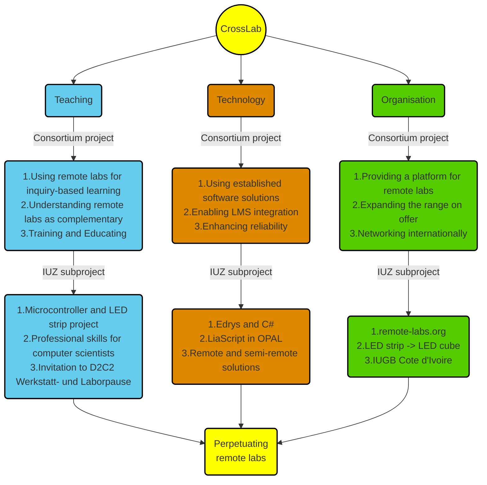

<!--
author:   Your Name
email:    your@email.com
version:  0.1.0
language: en
narrator: US English Female

comment:  This simple description of your course.
          Multiline is also okay.

link:     https://cdn.jsdelivr.net/chartist.js/latest/chartist.min.css

script:   https://cdn.jsdelivr.net/chartist.js/latest/chartist.min.js

icon: https://upload.wikimedia.org/wikipedia/commons/2/28/Logo_TU_Freiberg.svg

import: https://raw.githubusercontent.com/liaScript/mermaid_template/master/README.md

translation: Français translations/French.md
-->

# Putting the Lab (back) into Language Lab

> Overview

    {{1}}
- Who are we?

    {{2}}
- Who are you?

    {{3}}
- What is the CrossLab project?

    {{4}}
- What language courses do we offer?

    {{5}}
- What did we do in Summer 2023?

    {{6}}
- What will we do in Summer 2024?

    {{7}}
- How do we integrate CrossLab and Language courses?

    {{8}}
- Where do we go from here?

## Who are we?

    {{1}}
- Prof. Sebastian Zug (Professor of Robotics and Embedded systems)
- Dr. Andre Dietrich (Developer)
- Marco Naumann (Student assistant)
- Björn Kerman (Student assistant)
- Anandu Nair (Student assistant)
- Dr. Mark Jacob (Lecturer in English for Specific Purposes)

    {{2}}
https://www.researchgate.net/profile/Mark-Jacob-3

## Who are you?

??

## What is the CrossLab project?

    {{0-2}}
The advantages of digital laboratory solutions did not only become apparent with the pandemic situation of 2020. The preparation of the learning content in the form of digital, interactive simulations, video recordings or via remote access, with permanent availability, opens up a flexible schedule that corresponds to the individual work rhythm and level of knowledge. Although the successful implementation and didactic evaluation have been documented for a large number of installations in different departments1, these remain isolated locally at the university. Despite the content coverage, the fixed installations, which were tailored to the requirements at one location, cannot easily be transferred to the context (previous knowledge of the students, individual focus areas, scope of the task) at another location. The systems are usually reserved for the small group of users of their own students, which is regrettable in view of the conceptual effort and the high financial commitment.

    {{1-2}}
Accordingly, the CrossLab project aims to define the technical, didactic and organizational solutions for open digital laboratory objects, which can be combined as required in a learning environment for student-centered teaching. The cross in the project name stands for the interlinking of different laboratory components, media realities, as well as a cross-disciplinary and cross-university network. In addition to the conception and implementation of a technical implementation (configuration and linking of the individual laboratory objects) and new applications in various disciplines (physics, chemistry, computer science, mechanical engineering and process engineering), the didactic concepts are further developed in order to ensure a maximum of broad integration into other subjects can.

    {{2-3}}
> ...the CrossLab project aims to define the:
>
> - technical,
> - didactic and
> - organizational
>
> solutions for **open digital laboratory objects**, which can be combined as required in a learning environment for **student-centered teaching**.

    {{3}}
https://link.springer.com/chapter/10.1007/978-3-031-42467-0_56

## What language courses do we offer?

    {{1-2}}
https://tu-freiberg.de/iuz/sprachen/sprachenangebot/englisch

    {{2}}
??

## What did we do in summer 2023?

    {{1-2}}
??

    {{2}}
??

## Whar will we do in summer 2024?

??

## How do we integrate CrossLab and Language courses?

## Where do we go from here?

